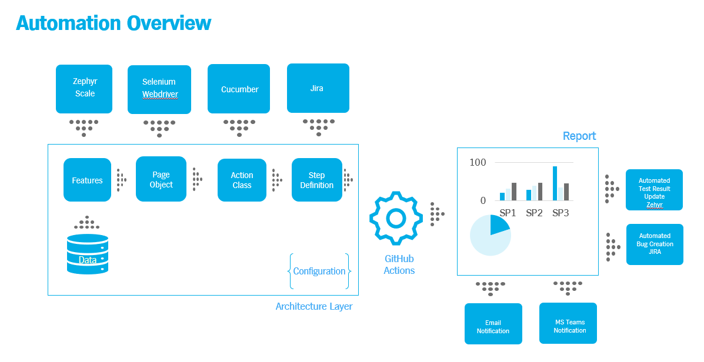

[](https://github.com/alipala/hybrid-test-automation/blob/main/.github/workflows/manual.yml)

## Table of Contents
1. [Introduction](#1-introduction)
2. [Test Plan](#2-overview)
3. [Test Plan](#3-test-plan)
4. [How to run tests on local](#4-how-to-run-the-tests-on-local)
5. [View the reports](#5-view-the-reports)
6. [How to run the test in a CI/CD](#6-how-to-run-the-test-in-a-cicd-github)
7. [Test Environment and Tech Stack](#7-test-environment-and-tech-stack)

## 1. Introduction
This repository is a demonstration to show how I develop a hybrid framework. Used test automation patterns 
for creating acceptance automated tests of an application for UI and backend.
It cannot be built unless you adapt the environment and page objects. 
It stores the smoke tests so that seeing the apps are good enough for the further testing. It consists of a minimal set of tests run 
on each build to test apps' functionalities. In simple terms, we are verifying whether 
the important features are working and there are no showstoppers in the build that is under testing.

## 2. Overview
[Test Automation Overview](docs/overview.PNG)


## 3. Test Plan
All details about the object, approach, features to be tested and more in [Test Plan](docs/test_plan.md)

## 4. How to run the tests on local
1. Clone the repository
```
https://github.com/alipala/hybrid-test-automation.git
```

2. The project supports Maven build scripts. To run the tests with Maven, open a command window and run:
```
mvn clean verify
```

## 5. View the reports
The command provided above will produce a Serenity test report in the `target/site/serenity/index.html` directory.
After running the tests, Serenity will provide you the report link automatically. Just click!

## 6. How to run the test in a CI/CD (GitHub)
1. Follow this link below to see the workflows
```
https://github.com/alipala/hybrid-test-automation/actions
```


## 7. Test Environment and Tech Stack
* App for retail store management 
* Google Chrome
* Serenity BDD
* Cucumber 6 
* Selenium Webdriver for Java bindings
* JUnit for test framework
* See the other dependencies in pom.xml like JDBC for Oracle DB connection, Jira and Zephyr integration, etc.

## Important Note
The JAVA and MAVEN must be installed and set the environment variable depends on your OS
